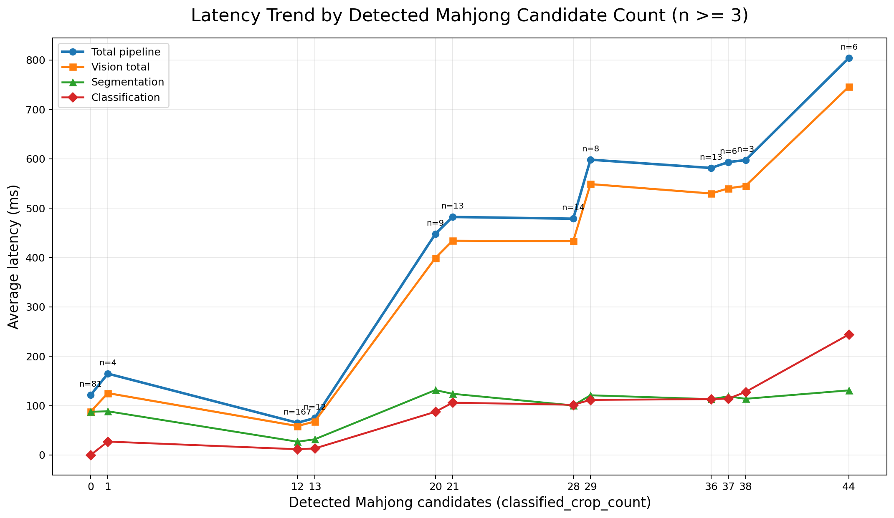
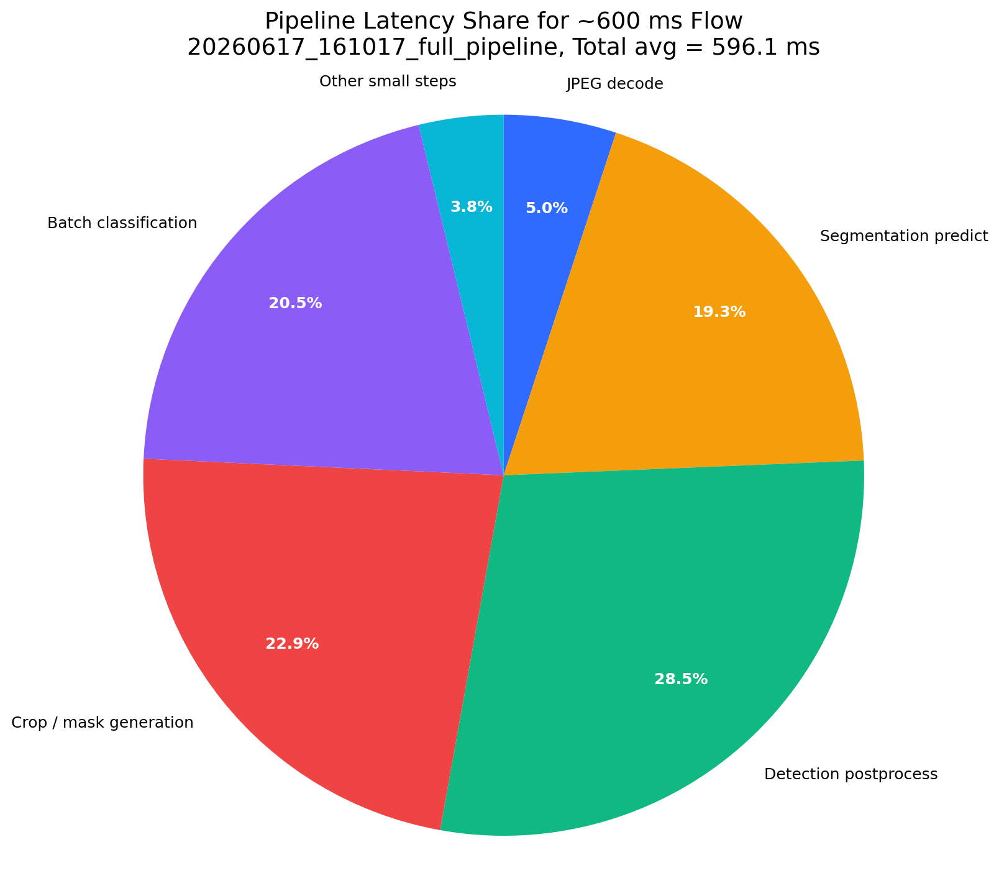

# VR Mahjong Latency Analysis

?????`C:\Users\user\Desktop\VR_Mahjong_System\server\seg_latency_results`  
?????`classified_crop_count`???????? crop/classification ???????????????????? `n >= 3` ????????????? CSV?

## ? 1??????? vs ????

## ?? 1?????????????n >= 3?

| tiles | frames | avg_table | total_ms | seg_ms | post_ms | crop_ms | cls_ms | ppo_ms |
| --- | --- | --- | --- | --- | --- | --- | --- | --- |
| 0 | 81 | 0 | 121.422 | 87.437 | 0.072 | 0 | 0 | 3.656 |
| 1 | 4 | 0.5 | 164.719 | 88.525 | 4.986 | 4.003 | 27.142 | 2.986 |
| 12 | 167 | 7.97 | 65.252 | 26.871 | 12.673 | 7.325 | 11.634 | 0.696 |
| 13 | 12 | 8.167 | 74.794 | 31.749 | 14.725 | 7.984 | 13.172 | 0.726 |
| 20 | 9 | 11.333 | 447.658 | 131.43 | 106.159 | 73.473 | 87.454 | 3.618 |
| 21 | 13 | 11.923 | 482.131 | 123.946 | 118.932 | 84.535 | 105.935 | 4.435 |
| 28 | 14 | 11.857 | 478.595 | 100.37 | 129.173 | 101.31 | 101.689 | 3.574 |
| 29 | 8 | 11.75 | 598.143 | 120.94 | 189.571 | 126.067 | 111.58 | 3.351 |
| 36 | 13 | 19.231 | 581.372 | 113.089 | 167.872 | 135.191 | 113.138 | 3.655 |
| 37 | 6 | 19.167 | 593.32 | 118.739 | 172.09 | 134.717 | 114.111 | 3.422 |
| 38 | 3 | 21 | 597.319 | 113.779 | 166.496 | 136.904 | 127.672 | 3.193 |
| 44 | 6 | 26.5 | 804.519 | 130.924 | 210.453 | 160.017 | 244.239 | 3.315 |

## ? 2?? 600 ms ????????

## ?? 2?? 600 ms ????????

| component | avg_ms | share_percent |
| --- | --- | --- |
| JPEG decode | 30.081 | 5.05 |
| Segmentation predict | 115.067 | 19.3 |
| Detection postprocess | 169.746 | 28.47 |
| Crop / mask generation | 136.558 | 22.91 |
| Batch classification | 122.083 | 20.48 |
| Mahjong agent / PPO block | 6.928 | 1.16 |
| Tracking + tile build + hand parse | 9.069 | 1.52 |
| JSON serialize + socket send | 1.148 | 0.19 |
| Other overhead | 5.452 | 0.91 |
